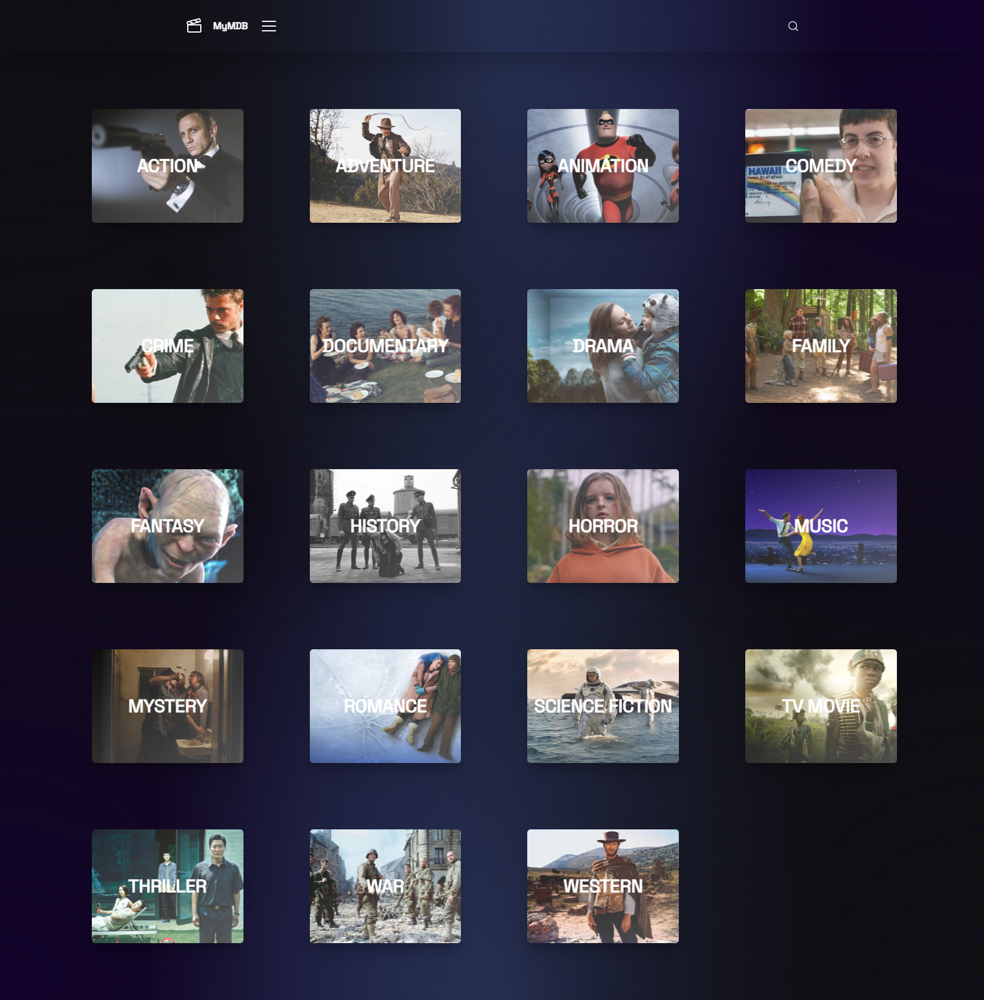
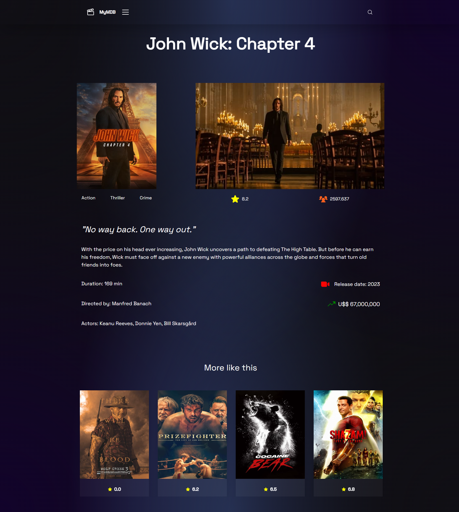

<h1 align="center"> MyMovieDB </h1>

 

  
  <!-- 
   -->

 

## 💻 Project

 ### What is the MyMovieDB?
   This application is a web-based simulation of the popular movie database website IMDb. We developed this one to improve our skills in React 18, HTTP requests and tailwind, and also to put in our portfolio! We are passionate about movies and like a lot to use IMDb to search for some movies, so we think it could be nice to built our own movie database with our styles tastes.

 

## 🪐 Installation
To run this application locally, follow these steps:

- Clone the repository to your local machine by using.
- Install the required dependencies by running `npm install` in the project directory.
- Start the server by running `npm run dev`.
- Open your web browser and navigate to http://localhost:3000.

 

## ☄️ Features

- View the top 20 movies of all time.
- View the latest releases.
- View the most popular movies.
- View the upcoming movies.
- Filter movies by genre.
- Browse the top 100 movies of all time.
- Browse tv shows, filtering by genre.
- Search for movies by title or keyword.

 

## 🚀 Technologies

- React 
- Typescript
- Tailwind
- [Vite](https://vitejs.dev/)

 

## 📚 Other Libraries

- [Radix](https://www.radix-ui.com/)
- [Phosphor Icons](https://phosphoricons.com/)

 

## 🔖 Website
If you are interested, check out the project by clicking on the link below

- [MyMovieDB](https://mymoviedb.vercel.app/)

## 🧠 Credits

This project was developed by <a href="https://github.com/jotapemattos">João Pedro Mattos</a> and  <a href="https://github.com/LucasP1nheiro">Lucas Pinheiro</a> 

